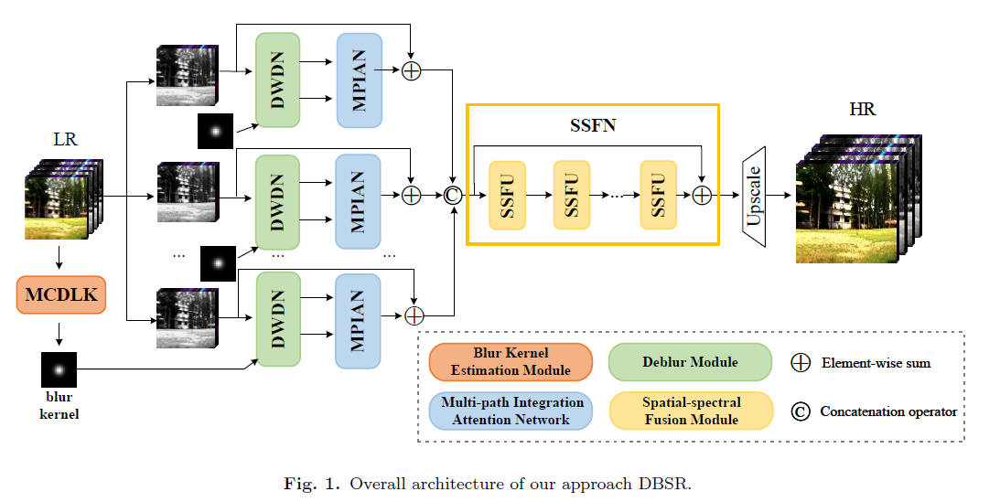

# Deep-Blind-Super-Resolution-for-Hyperspectral-Images
Deep Blind Super-Resolution for Hyperspectral Images 
Accepted by Pattern Recognition

### Train：

python train_GTandBlur.py -opt=options/setting2/train/train_setting2_x4.yml

### Test：
python test.py -opt=options/setting2/test/test_setting2_x4.yml
